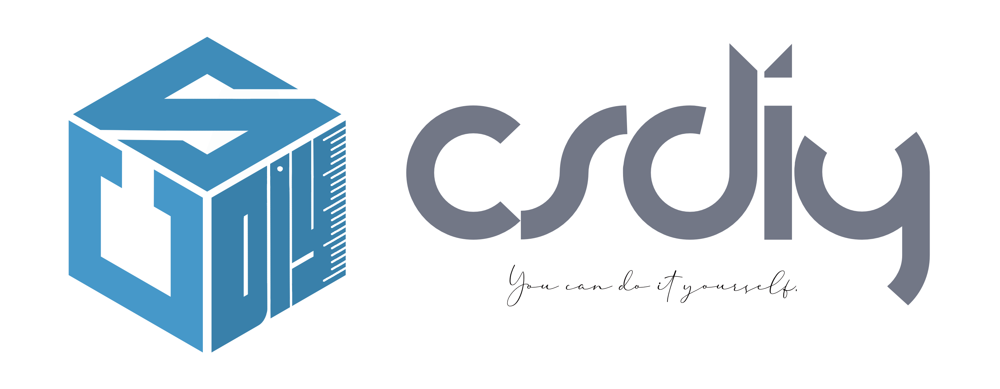

<figure markdown>
  { width="600" }
</figure>

# 前言

**最近更新：英文版正在[建设中](https://github.com/PKUFlyingPig/cs-self-learning/issues/222)，增加陈天奇[机器学习编译](机器学习系统/MLC.md)，增加 CMU [机器学习系统](机器学习系统/CMU10-414.md), 增加 [学习工作流](必学工具/workflow.md)**
<!-- **最近更新：增加[Caltech CS 122: Database System Implementation](./数据库系统/CS122.md) ，重新整理[好书推荐](./%E5%A5%BD%E4%B9%A6%E6%8E%A8%E8%8D%90.md)模块 ~** -->
<!-- **最近更新：增加南京大学[操作系统课程](操作系统/NJUOS.md)，增加毕业论文[写作教程](必学工具/thesis.md) ～** -->

这是一本计算机的自学指南，也是对自己大学三年自学生涯的一个纪念。

这同时也是一份献给北大信科学弟学妹们的礼物。如果这本书能对你们的信科生涯有哪怕一丝一毫的帮助，都是对我极大的鼓励和慰藉。

本书目前包括了以下部分(如果你有其他好的建议，或者想加入贡献者的行列，欢迎邮件 [zhongyinmin@pku.edu.cn](mailto:zhongyinmin@pku.edu.cn) 或者在 issue 里提问)：

- 必学工具：IDE, 翻墙, StackOverflow, Git, GitHub, Vim, LaTeX, GNU Make, 实用工具 ...
- 环境配置：PC端以及服务器端开发环境配置、各类运维相关教材及资料 ...
- 经典书籍推荐：看过 CSAPP 这本书的同学一定感叹好书的重要，我将列举推荐自己看过的计算机领域的必看好书与资源链接。
- **国外高质量 CS 课程汇总**：我将把我上过的所有高质量的国外 CS 课程分门别类进行汇总，并给出相关的自学建议，大部分课程都会有一个独立的仓库维护相关的资源以及我的作业实现。

## 梦开始的地方 —— CS61A

大一入学时我是一个对计算机一无所知的小白，装了几十个 G 的 Visual Studio 天天和 OJ 你死我活。凭着高中的数学底子我数学课学得还不错，但在专业课上对竞赛大佬只有仰望。提到编程我只会打开那笨重的 IDE，新建一个我也不知道具体是干啥的命令行项目，然后就是 `cin`, `cout`, `for` 循环，然后 CE, RE, WA 循环。当时的我就处在一种拼命想学好但不知道怎么学，课上认真听讲但题还不会做，课后做作业完全是用时间和它硬耗的痛苦状态。我至今电脑里还存着自己大一上学期计算概论大作业的源代码 —— 一个 1200 行的 C++ 文件，没有头文件、没有类、没有封装、没有 unit test、没有 Makefile、没有 Git，唯一的优点是它确实能跑，缺点是“能跑”的补集。我一度怀疑我是不是不适合学计算机，因为童年对于极客的所有想象，已经被我第一个学期的体验彻底粉碎了。

这一切的转机发生在我大一的寒假，我心血来潮想学习 Python。无意间看到知乎有人推荐了 CS61A 这门课，说是 UC Berkeley 的大一入门课程，讲的就是 Python。我永远不会忘记那一天，打开 [CS61A](https://cs61a.org/) 课程网站的那个瞬间，就像哥伦布发现了新大陆一样，我开启了新世界的大门。

我一口气 3 个星期上完了这门课，它让我第一次感觉到原来 CS 可以学得如此充实而有趣，原来这世上竟有如此精华的课程。

为避免有崇洋媚外之嫌，我单纯从一个学生的视角来讲讲自学 CS61A 的体验：

- 独立搭建的课程网站: 一个网站将所有课程资源整合一体，条理分明的课程 schedule、所有 slides, hw, discussion 的文件链接、详细明确的课程给分说明、历年的考试题与答案。这样一个网站抛开美观程度不谈，既方便学生，也让资源公正透明。

- 课程教授亲自编写的教材：CS61A 这门课的开课老师将MIT的经典教材 *Structure and Interpretation of Computer Programs* (SICP) 用Python这门语言进行改编（原教材基于 Scheme 语言），保证了课堂内容与教材内容的一致性，同时补充了更多细节，可以说诚意满满。而且全书开源，可以直接线上阅读。

- 丰富到让人眼花缭乱的课程作业：14 个 lab 巩固随堂知识点，10 个 homework，还有 4 个代码量均上千行的 project。与大家熟悉的 OJ 和 Word 文档式的作业不同，所有作业均有完善的代码框架，保姆级的作业说明。每个 Project 都有详尽的 handout 文档、全自动的评分脚本。CS61A 甚至专门开发了一个[自动化的作业提交评分系统](https://okpy.org/)（据说还发了论文）。当然，有人会说“一个 project 几千行代码大部分都是助教帮你写好的，你还能学到啥？”。此言差矣，作为一个刚刚接触计算机，连安装 Python 都磕磕绊绊的小白来说，这样完善的代码框架既可以让你专注于巩固课堂上学习到的核心知识点，又能有“我才学了一个月就能做一个小游戏了！”的成就感，还能有机会阅读学习别人高质量的代码，从而为自己所用。我觉得在低年级，这种代码框架可以说百利而无一害。唯一的害也许是苦了老师和助教，因为开发这样的作业可想而知需要相当的时间投入。

- 每周 Discussion 讨论课，助教会讲解知识难点和考试例题：类似于北京大学 ICS 的小班研讨，但习题全部用 LaTeX 撰写，相当规范且会明确给出 solution。

这样的课程，你完全不需要任何计算机的基础，你只需要努力、认真、花时间就够了。此前那种有劲没处使的感觉，那种付出再多时间却得不到回报的感觉，从此烟消云散。这太适合我了，我从此爱上了自学。

试想如果有人能把艰深的知识点嚼碎嚼烂，用生动直白的方式呈现给你，还有那么多听起来就很 fancy，种类繁多的 project 来巩固你的理论知识，你会觉得他们真的是在倾尽全力想方设法地让你完全掌握这门课，你会觉得不学好它简直是对这些课程建设者的侮辱。

如果你觉得我在夸大其词，那么不妨从 [CS61A](https://cs61a.org/) 开始，因为它是我的梦开始的地方。

## 为什么写这本书

在我2020年秋季学期担任《深入理解计算机系统》（CSAPP）这门课的助教时，我已经自学一年多了。这一年多来我无比享受这种自学模式，为了分享这种快乐，我为自己的小班同学做过一个 [CS自学资料整理仓库](https://github.com/PKUFlyingPig/Self-learning-Computer-Science)。当时纯粹是心血来潮，因为我也不敢公然鼓励大家翘课自学。

但随着又一年时间的维护，这个仓库的内容已经相当丰富，基本覆盖了计科、智能系、软工系的绝大多数课程，我也为每个课程都建了各自的 GitHub 仓库，汇总我用到的自学资料以及作业实现。

直到大四开始凑学分毕业的时候，我打开自己的培养方案，我发现它已经是我这个自学仓库的子集了，而这距离我开始自学也才两年半而已。于是，一个大胆的想法在我脑海中浮现：也许，我可以打造一个自学式的培养方案，把我这三年自学经历中遇到的坑、走过的路记录下来，以期能为后来的学弟学妹们贡献自己的一份微薄之力。

如果大家可以在三年不到的时间里就能建立起整座CS的基础大厦，能有相对扎实的数学功底和代码能力，经历过数十个千行代码量的 Project 的洗礼，掌握至少 C/C++/Java/JS/Python/Go/Rust 等主流语言，对算法、电路、体系、网络、操统、编译、人工智能、机器学习、计算机视觉、自然语言处理、强化学习、密码学、信息论、博弈论、数值分析、统计学、分布式、数据库、图形学、Web开发、云服务、超算等等方面均有涉猎。我想，你将有足够的底气和自信选择自己感兴趣的方向，无论是就业还是科研，你都将有相当的竞争力。

因为我坚信，既然你能坚持听我 BB 到这里，你一定不缺学好 CS 的能力，你只是没有一个好的老师，给你讲一门好的课程。而我，将力图根据我三年的体验，为你挑选这样的课程。

## 自学的好处

对我来说，自学最大的好处就在于可以完全根据自己的进度来调整学习速度。对于一些疑难知识点，我可以反复回看视频，在网上谷歌相关的内容，上 StackOverflow 提问题，直到完全将它弄明白。而对于自己掌握得相对较快的内容，则可以两倍速甚至三倍速略过。

自学的另一大好处就是博采众长。计算机系的几大核心课程：体系、网络、操统、编译，每一门我基本都上过不同大学的课程，不同的教材、不同的知识点侧重、不同的 project 将会极大丰富你的视野，也会让你理解错误的一些内容得到及时纠正。

自学的第三个好处是时间自由，具体原因省略。

## 自学的坏处

当然，作为 CS 自学主义的忠实拥趸，我不得不承认自学也有它的坏处。

第一就是交流沟通的不便。我其实是一个很热衷于提问的人，对于所有没有弄明白的点，我都喜欢穷追到底。但当你面对着屏幕听到老师讲了一个你没明白的知识点的时候，你无法顺着网线到另一端向老师问个明白。我努力通过独立思考和善用 Google 来缓解这一点，但是，如果能有几个志同道合的伙伴结伴自学，那将是极好的。关于交流群的建立，大家可以参考仓库 `README` 中的教程。

第二就是这些自学的课程基本都是英文的。从视频到slides到作业全是英文，所以有一定的门槛。不过我觉得这个挑战如果你克服了的话对你是极为有利的。因为在当下，虽然我很不情愿，但也不得不承认，在计算机领域，很多优质的文档、论坛、网站都是全英文的。养成英文阅读的习惯，在赤旗插遍世界之前，还是有一定好处的（狗头保命）。

第三，也是我觉得最困难的一点，就是自律。因为没有 DDL 有时候真的是一件可怕的事情，特别是随着学习的深入，国外的很多课程是相当虐的。你得有足够的驱动力强迫自己静下心来，阅读几十页的 Project Handout，理解上千行的代码框架，忍受数个小时的 debug 时光。而这一切，没有学分，没有绩点，没有老师，没有同学，只有一个信念 —— 你在变强。

## 这本书适合谁

正如我在前言里说的，任何有志于自学计算机的朋友都可以参考这本书。如果你已经有了一定的计算机基础，只是对某个特定的领域感兴趣，可以选择性地挑选你感兴趣的内容进行学习。当然，如果你是一个像我当年一样对计算机一无所知的小白，初入大学的校门，我希望这本书能成为你的攻略，让你花最少的时间掌握你所需要的知识和能力。某种程度上，这本书更像是一个根据我的体验来排序的课程搜索引擎，帮助大家足不出户，体验世界顶级名校的计算机优质课程。

当然，作为一个还未毕业的本科生，我深感自己没有能力也没有权利去宣扬一种学习方式，我只是希望这份资料能让那些同样有自学之心和毅力朋友可以少走些弯路，收获更丰富、更多样、更满足的学习体验。

## 特别鸣谢

在这里，我怀着崇敬之心真诚地感谢所有将课程资源无偿开源的各位教授们。这些课程倾注了他们数十年教学生涯的积淀和心血，他们却选择无私地让所有人享受到如此高质量的CS教育。没有他们，我的大学生活不会这样充实而快乐。很多教授在我给他们发了感谢邮件之后，甚至会回复上百字的长文，真的让我无比感动。他们也时刻激励着我，做一件事，就得用心做好，无论是科研，还是为人。

## 你也想加入到贡献者的行列

一个人的力量终究是有限的，这本书也是我在繁重的科研之余熬夜抽空写出来的，难免有不够完善之处。另外，由于个人做的是系统方向，很多课程侧重系统领域，对于数学、理论计算机、高级算法相关的内容则相对少些。如果有大佬想在其他领域分享自己的自学经历与资源，可以直接在项目中发起 Pull Request，也欢迎和我邮件联系（[zhongyinmin@pku.edu.cn](mailto:zhongyinmin@pku.edu.cn)）。

## 关于交流群的建立

方法参见仓库的 `README.md`。
